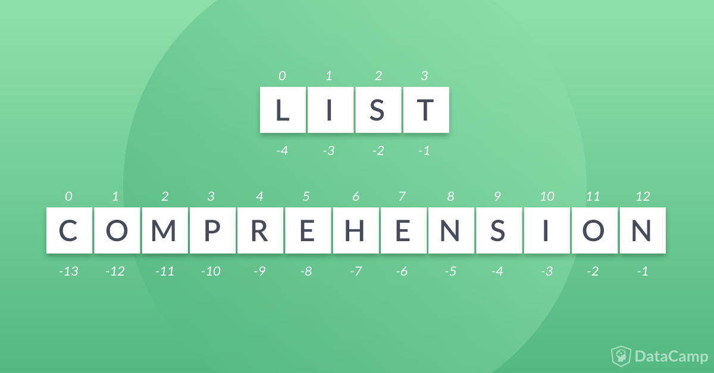

### List 列表


[TOC]

[Lists and Tuples in Python](https://realpython.com/python-lists-tuples/)




```python
a = ['foo', 'bar', 'baz', 'qux', 'quux', 'corge']
print(type(a))
print(a)
```

    <class 'list'>
    ['foo', 'bar', 'baz', 'qux', 'quux', 'corge']


```python
print(list())
print(list([]))
print(list(["bee", "moth", "ant"]))
print(list([["bee", "moth"], ["ant"]]))

a = "bee"
print(list(a))

a = ("I", "am", "a", "tuple")
print(list(a))

a = {"I", "am", "a", "set"}
print(list(a))
```

    []
    []
    ['bee', 'moth', 'ant']
    [['bee', 'moth'], ['ant']]
    ['b', 'e', 'e']
    ['I', 'am', 'a', 'tuple']
    ['I', 'set', 'am', 'a']


#### range()

    range(stop)
    range(start, stop[, step])


```python
print(list(range(10)))
print(list(range(1,11)))
print(list(range(51,56)))
print(list(range(1,11,2)))
```

    [0, 1, 2, 3, 4, 5, 6, 7, 8, 9]
    [1, 2, 3, 4, 5, 6, 7, 8, 9, 10]
    [51, 52, 53, 54, 55]
    [1, 3, 5, 7, 9]


#### 切片取值


```python
print(a[2])  # 输出索引位置为2，5的值
print(a[5])
```

    baz
    corge


```python
print(a[-2])  # 输出倒数第2第5个值
print(a[-5])
```

    quux
    bar


```python
print(a[2:5])  # 输出索引位置为2-5之间的值
```

    ['baz', 'qux', 'quux']


```python
print(a[-2:])  # 输出倒数第二个值之后的元素
```

    ['quux', 'corge']


```python
a[-5:-2]
```


    ['bar', 'baz', 'qux']


```python
a[1:4]
```


    ['bar', 'baz', 'qux']


```python
 a[-5:-2] == a[1:4]
```


    True


```python
print(a[:4], a[0:4])  # 等价输出
```

    ['foo', 'bar', 'baz', 'qux'] ['foo', 'bar', 'baz', 'qux']


```python
print(a[2:], a[2:len(a)])
```

    ['baz', 'qux', 'quux', 'corge'] ['baz', 'qux', 'quux', 'corge']


```python
a[:4] + a[4:]  # 列表元素拼接
```


    ['foo', 'bar', 'baz', 'qux', 'quux', 'corge']


```python
a[:4] + a[4:] == a
```


    True


#### 更改切片步长


```python
a[0:6:2]  # 以2为步长
```


    ['foo', 'baz', 'quux']


```python
a[1:6:2]
```


    ['bar', 'qux', 'corge']


```python
a[6:0:-2]  # 逆向输出，步长为2
```


    ['corge', 'qux', 'bar']


```python
a[::-1]  # 列表反转，逆序输出
```


    ['corge', 'quux', 'qux', 'baz', 'bar', 'foo']


#### [:]切片引用

语法`[:]`适用于列表。但是，这个操作处理列表的方式与处理字符串的方式有一个重要的区别。

如果s是字符串，s[:]返回对同一对象的引用:

##### [:]对于字符串，完整的切片是的等价的


```python
s = 'foobar'
s
```


    'foobar'


```python
s[:]
```


    'foobar'


```python
s[:] is s  # 等价
```


    True


##### [:]的列表使用不等价


```python
a = ['foo', 'bar', 'baz', 'qux', 'quux', 'corge']
a
```


    ['foo', 'bar', 'baz', 'qux', 'quux', 'corge']


```python
a[:]
```


    ['foo', 'bar', 'baz', 'qux', 'quux', 'corge']


```python
a[:] is a
```


    False


#### 类字符串操作

一些Python操作符和内置函数也可以用类似于字符串的方式与列表一起使用:
    
in和not in操作符:


```python
a
```


    ['foo', 'bar', 'baz', 'qux', 'quux', 'corge']


```python
'qux' in a
```


    True


```python
'fux' in a
```


    False


#### 连接(+)和复制(*)操作符:


```python
a
```


    ['foo', 'bar', 'baz', 'qux', 'quux', 'corge']


```python
a + ['grault', 'garply']
```


    ['foo', 'bar', 'baz', 'qux', 'quux', 'corge', 'grault', 'garply']


```python
print(a * 2)
```

    ['foo', 'bar', 'baz', 'qux', 'quux', 'corge', 'foo', 'bar', 'baz', 'qux', 'quux', 'corge']


#### 索引获取


```python
list_numbers = [1, 'two', 3, 4, 5, 6, 7, 8, 9, 10]
element = 'two'
list_numbers.index(element)
```


    1


重复元素的列表索引


```python
list_numbers = [3, 1, 2, 3, 3, 4, 5, 6, 3, 7, 8, 9, 10]
element = 3
list_numbers.index(element)
```


    0


返回的位置是0，因为在Python中，3首先出现在第一个位置或第0个索引中。

这是内部发生的事情:index将遍历从第1个位置(第0个索引)开始的所有值，寻找您正在搜索的元素，一旦找到了该值—它将返回位置并退出系统。但是，在处理一个较大的列表时，这不是很有效，您需要在列表末尾获得某个东西的位置。

index()为您提供了一个参数选项，以提示搜索值可能位于何处。


```python
list_numbers = [1, 2, 3, 4, 5, 6, 7, 8, 9, 10]
element = 7
list_numbers.index(element, 5, 8)
```


    6


     list_name.index(element, start, stop).


```python
list_numbers = [1, 2, 3, 4, 5, 6, 7, 8, 9, 10]
element = 7
list_numbers.index(element, 1, 5)
```


    ---------------------------------------------------------------------------
    
    ValueError                                Traceback (most recent call last)
    
    <ipython-input-120-f99b32601fd5> in <module>()
          1 list_numbers = [1, 2, 3, 4, 5, 6, 7, 8, 9, 10]
          2 element = 7
    ----> 3 list_numbers.index(element, 1, 5)


    ValueError: 7 is not in list


注意:由于index()只返回对象的第一个匹配项，所以如果需要列表中更多匹配项的位置，可以使用列表推导式，或者生成器表达式。这里是:


```python
list_numbers = [3, 1, 2, 3, 3, 4, 5, 6, 3, 7, 8, 9, 10]
[i for i, n in enumerate(list_numbers) if n == 3] # List comprehension
```


    [0, 3, 4, 8]


```python
list_numbers = [3, 1, 2, 3, 3, 4, 5, 6, 3, 7, 8, 9, 10]
g = (i for i, n in enumerate(list_numbers) if n == 3) # Generator expression
print("Generators store values, the first value here is:", next(g), ". Then the next is:", next(g), "followed by ", next(g),"and finally ", next(g))
```

    Generators store values, the first value here is: 0 . Then the next is: 3 followed by  4 and finally  8


```python
a = ["bee", "ant", "moth", "ant"]
print(a.index("ant"))
print(a.index("ant", 2))  # 从指定索引开始
```

    1
    3


#### count(x) 统计元素


```python
a = ["bee", "ant", "moth", "ant"]
print(a.count("bee"))
print(a.count("ant"))
print(a.count(""))
```

    1
    2
    0


#### len()、min()和max()函数:


```python
a
```


    ['foo', 'bar', 'baz', 'qux', 'quux', 'corge']


##### 列表长度


```python
len(a)
```


    6


##### 最大值


```python
max(a)
```


    'qux'


##### 最小值


```python
min(a)
```


    'bar'


字符串和列表的行为如此相似并非偶然。它们都是称为iterable的更通用对象类型的特殊情况

顺便说一下，在上面的每个例子中，在对列表执行操作之前，它总是被分配给一个变量。但是你也可以对列表文字进行操作:


```python
['foo', 'bar', 'baz', 'qux', 'quux', 'corge'][2]
```


    'baz'


```python
a = ["bee", "moth", "ant"]
print(max(a))

a = ["bee", "moth", "wasp"]
print(max(a))

a = [1, 2, 3, 4, 5]
b = [1, 2, 3, 4]
print(max(a, b))
```

    moth
    wasp
    [1, 2, 3, 4, 5]


```python
a = ["bee", "moth", "wasp"]
print(min(a))

a = ["bee", "moth", "ant"]
print(min(a))

a = [1, 2, 3, 4, 5]
b = [1, 2, 3, 4]
print(min(a, b))
```

    bee
    ant
    [1, 2, 3, 4]


#### 反转-逆序输出


```python
['foo', 'bar', 'baz', 'qux', 'quux', 'corge'][::-1]
```


    ['corge', 'quux', 'qux', 'baz', 'bar', 'foo']


```python
'quux' in ['foo', 'bar', 'baz', 'qux', 'quux', 'corge']
```


    True


```python
['foo', 'bar', 'baz'] + ['qux', 'quux', 'corge']
```


    ['foo', 'bar', 'baz', 'qux', 'quux', 'corge']


```python
len(['foo', 'bar', 'baz', 'qux', 'quux', 'corge'][::-1])
```


    6


同样的，你也可以用字符串文字:


```python
'If Comrade Napoleon says it, it must be right.'[::-1]
```


    '.thgir eb tsum ti ,ti syas noelopaN edarmoC fI'


#### 列表嵌套

列表可以包含子列表，子列表又可以包含子列表本身，以此类推，直到任意深度。


```python
x = ['a', ['bb', ['ccc', 'ddd'], 'ee', 'ff'], 'g', ['hh', 'ii'], 'j']
x
```


    ['a', ['bb', ['ccc', 'ddd'], 'ee', 'ff'], 'g', ['hh', 'ii'], 'j']


```python
print(x[0], x[2], x[4])
```

    a g j


```python
x[1]
```


    ['bb', ['ccc', 'ddd'], 'ee', 'ff']


```python
x[3]
```


    ['hh', 'ii']


要访问子列表中的项目，只需添加一个附加索引:


```python
print(x[1])
print(x[1][0])
print(x[1][1])
print(x[1][2])
```

    ['bb', ['ccc', 'ddd'], 'ee', 'ff']
    bb
    ['ccc', 'ddd']
    ee


```python
print(x[1][1][0], x[1][1][1])
```

    ccc ddd


```python
print(x[1][1][-1])
```

    ddd


```python
print(x[1][1:3])
```

    [['ccc', 'ddd'], 'ee']


```python
print(x[3][::-1])
```

    ['ii', 'hh']


嵌套列表的长度


```python
print(x)
print(len(x))
```

    ['a', ['bb', ['ccc', 'ddd'], 'ee', 'ff'], 'g', ['hh', 'ii'], 'j']
    5


x只有五个元素——三个字符串和两个子列表。子列表中的单个元素不计入x的长度。


```python
print('ddd' in x)
print('ddd' in x[1])
print('ddd' in x[1][1])
```

    False
    False
    True


#### 列表是可变的

到目前为止，遇到的大多数数据类型都是原子类型。例如，Integer或float对象是不能进一步分解的基本单元。这些类型是不可变的，这意味着一旦分配了它们，就不能更改它们。考虑改变整数的值没有多大意义。如果你想要一个不同的整数，你只需要分配一个不同的。

相反，字符串类型是复合类型。字符串可以简化为更小的部分——组件字符。考虑更改字符串中的字符可能是有意义的。但是你不能。在Python中，字符串也是不可变的。

列表是您遇到的第一个可变数据类型。一旦创建了一个列表，就可以随意添加、删除、移动和移动元素。Python提供了广泛的方法来修改列表。

##### 修改替换列表值
列表中的一个值可以用索引和简单的赋值替换:


```python
a = ['foo', 'bar', 'baz', 'qux', 'quux', 'corge']
a
```


    ['foo', 'bar', 'baz', 'qux', 'quux', 'corge']


```python
a[2] = 10
a[-1] = 20
a
```


    ['foo', 'bar', 10, 'qux', 'quux', 20]


列表a中的元素已经被修改

字符串是不可修改的


```python
s = 'foobarbaz'
s[2] = 'x'
```


    ---------------------------------------------------------------------------
    
    TypeError                                 Traceback (most recent call last)
    
    <ipython-input-54-51cf32393b91> in <module>()
          1 s = 'foobarbaz'
    ----> 2 s[2] = 'x'


    TypeError: 'str' object does not support item assignment


使用del命令可以删除列表项:


```python
a = ['foo', 'bar', 'baz', 'qux', 'quux', 'corge']
a
```


    ['foo', 'bar', 'baz', 'qux', 'quux', 'corge']


```python
del a[3]  # 删除索引位置为3的元素
```


```python
a
```


    ['foo', 'bar', 'baz', 'quux', 'corge']


同时修改多个列表元素


```python
a = ['foo', 'bar', 'baz', 'qux', 'quux', 'corge']

a[1:4]
```


    ['bar', 'baz', 'qux']


```python
a[1:4] = [1.1, 2.2, 3.3, 4.4, 5.5]
a
```


    ['foo', 1.1, 2.2, 3.3, 4.4, 5.5, 'quux', 'corge']


```python
a[1:6]
```


    [1.1, 2.2, 3.3, 4.4, 5.5]


```python
a[1:6] = ['Bark!']
```


```python
a
```


    ['foo', 'Bark!', 'quux', 'corge']


插入的元素数不必等于替换的元素数。Python只根据需要增长或收缩列表。

可以插入多个元素来代替单个元素—只需使用一个只表示一个元素的切片:


```python
a = [1, 2, 3]
a[1:2] = [2.1, 2.2, 2.3]
a
```


    [1, 2.1, 2.2, 2.3, 3]


**注意，这与用列表替换单个元素不同:**


```python
a = [1, 2, 3]
a[1] = [2.1, 2.2, 2.3]
a
```


    [1, [2.1, 2.2, 2.3], 3]


还可以在不删除任何内容的情况下将元素插入列表。只需在所需索引处指定表单[n:n]的一个切片(一个零长度的切片):


```python
a = [1, 2, 7, 8]
a[2:2] = [3, 4, 5, 6]
a
```


    [1, 2, 3, 4, 5, 6, 7, 8]


通过将适当的切片分配给空列表，可以从列表中间删除多个元素。

你也可以使用del语句与相同的切片:


```python
a = ['foo', 'bar', 'baz', 'qux', 'quux', 'corge']
a[1:5] = []
a
```


    ['foo', 'corge']


```python
a = ['foo', 'bar', 'baz', 'qux', 'quux', 'corge']
del a[1:5]
a
```


    ['foo', 'corge']


将项前置或追加到列表中

可以使用`+ concatenation`运算符或`+=` augmented赋值运算符将附加项添加到列表的开始或结束:


```python
a = ['foo', 'bar', 'baz', 'qux', 'quux', 'corge']

a += ['grault', 'garply']
a
```


    ['foo', 'bar', 'baz', 'qux', 'quux', 'corge', 'grault', 'garply']


```python
a = ['foo', 'bar', 'baz', 'qux', 'quux', 'corge']

a = [10, 20] + a
a
```


    [10, 20, 'foo', 'bar', 'baz', 'qux', 'quux', 'corge']


注意，一个列表必须与另一个列表连接，所以如果你只想添加一个元素，你需要将它指定为一个单元素列表:


```python
a = ['foo', 'bar', 'baz', 'qux', 'quux', 'corge']
a += 20
```


    ---------------------------------------------------------------------------
    
    TypeError                                 Traceback (most recent call last)
    
    <ipython-input-70-e3768c0c25c3> in <module>()
          1 a = ['foo', 'bar', 'baz', 'qux', 'quux', 'corge']
    ----> 2 a += 20


    TypeError: 'int' object is not iterable


```python
a += [20]
a
```


    ['foo', 'bar', 'baz', 'qux', 'quux', 'corge', 20]


**注意:**从技术上讲，说一个列表必须与另一个列表连接是不太正确的。
    
更精确地说，列表必须与可迭代的对象连接。当然，列表是可迭代的，因此可以将一个列表与另一个列表连接起来。

字符串也是可迭代的。但是看看当你把一个字符串连接到一个列表时会发生什么:


```python
a = ['foo', 'bar', 'baz', 'qux', 'quux']
a += 'corge'
a
```


    ['foo', 'bar', 'baz', 'qux', 'quux', 'c', 'o', 'r', 'g', 'e']


这个结果可能不完全符合你的预期。当一个字符串被遍历时，结果是它的组件字符列表。

在上面的例子中，连接到列表a的是字符串“corge”中的字符列表。

如果你真的想在列表末尾添加一个字符串“corge”，你需要把它指定为一个单例列表:


```python
a = ['foo', 'bar', 'baz', 'qux', 'quux']
a += ['corge']
a
```


    ['foo', 'bar', 'baz', 'qux', 'quux', 'corge']


修改列表的方法

最后，Python提供了几个可用于修改列表的内置方法。关于这些方法的信息如下。

注意:你在前面的教程中看到的字符串方法没有直接修改目标字符串。这是因为字符串是不可变的。相反，string方法返回一个新的string对象，该对象按照方法的方向进行修改。它们保持原始目标字符串不变:


```python
s = 'foobar'
t = s.upper()
print(s, t)
```

    foobar FOOBAR


列表方法是不同的。因为列表是可变的，所以这里显示的列表方法将修改目标列表。

#### 添加元素

##### append()添加单个元素


```python
a = ['a', 'b']
a.append(123)
a
```


    ['a', 'b', 123]


记住，list方法修改目标列表。它们不返回新列表:


```python
a = ['a', 'b']
x = a.append(123)
print(x)
```

    None


```python
a
```


    ['a', 'b', 123]


请记住，当使用`+`运算符连接到一个列表时，如果目标操作数是可迭代的，那么它的元素将被分解并单独添加到列表中:


```python
a = ['a', 'b']
a + [1, 2, 3]
a
```


    ['a', 'b']


```python
a = ['a', 'b']
a.append([1, 2, 3])
a
```


    ['a', 'b', [1, 2, 3]]


```python
a = ['a', 'b']
a.append('foo')
a
```


    ['a', 'b', 'foo']


##### extend()扩展添加多个元素


```python
a = ['a', 'b']
a.extend([1, 2, 3])
a
```


    ['a', 'b', 1, 2, 3]


换句话说，`.extend()`的行为类似于`+`操作符。更准确地说，因为它修改了列表，所以它的行为类似于`+=`操作符:


```python
a = ['a', 'b']
a += [1, 2, 3]
a
```


    ['a', 'b', 1, 2, 3]


#### insert插入元素

http://python-ds.com/python-3-list-methods

    a.insert(<index>, <obj>)


```python
a = ["bee", "moth"]
print(a)
a.insert(0, "ant")
print(a)
a.insert(2, "fly")
print(a)
```

    ['bee', 'moth']
    ['ant', 'bee', 'moth']
    ['ant', 'bee', 'fly', 'moth']


将对象插入到列表a中指定的索引位置，其余列表元素向右推:


```python
a = ['foo', 'bar', 'baz', 'qux', 'quux', 'corge']
a.insert(3, 3.14159)
a[3]
```


    3.14159


```python
a
```


    ['foo', 'bar', 'baz', 3.14159, 'qux', 'quux', 'corge']


#### remove()移除操作

a.remove()从列表a中删除对象。如果不在a中，则抛出异常:


```python
a = ['foo', 'bar', 'baz', 'qux', 'quux', 'corge']
a.remove('baz')
a
```


    ['foo', 'bar', 'qux', 'quux', 'corge']


```python
a.remove('Bark!')
```


    ---------------------------------------------------------------------------
    
    ValueError                                Traceback (most recent call last)
    
    <ipython-input-86-11311083fb73> in <module>()
    ----> 1 a.remove('Bark!')


    ValueError: list.remove(x): x not in list


#### a.pop(index=-1)

    这个方法与.remove()有两个不同之处:
    指定要删除的项的索引，而不是对象本身。
    该方法返回一个值:已删除的项。
    a.pop()简单地删除列表中的最后一项:


```python
a = ['foo', 'bar', 'baz', 'qux', 'quux', 'corge']
a.pop()
a
```


    ['foo', 'bar', 'baz', 'qux', 'quux']


```python
a.pop()
a
```


    ['foo', 'bar', 'baz', 'qux']


如果指定了可选的参数，则删除并返回该索引处的项。可以是负数，如字符串和列表索引:


```python
a = ['foo', 'bar', 'baz', 'qux', 'quux', 'corge']
a.pop(1)
a
```


    ['foo', 'baz', 'qux', 'quux', 'corge']


```python
a.pop(-3)
a
```


    ['foo', 'baz', 'quux', 'corge']


列表是动态的


```python
a = ['foo', 'bar', 'baz', 'qux', 'quux', 'corge']

a[2:2] = [1, 2, 3]
a += [3.14159]
a
```


    ['foo', 'bar', 1, 2, 3, 'baz', 'qux', 'quux', 'corge', 3.14159]


```python
a = ['foo', 'bar', 'baz', 'qux', 'quux', 'corge']
a[2:3] = []
del a[0]
a
```


    ['bar', 'qux', 'quux', 'corge']


```python
# Example 1: No index specified
a = ["bee", "moth", "ant"]
print(a)
a.pop()
print(a)

# Example 2: Index specified
a = ["bee", "moth", "ant"]
print(a)
a.pop(1)
print(a)
```

    ['bee', 'moth', 'ant']
    ['bee', 'moth']
    ['bee', 'moth', 'ant']
    ['bee', 'ant']


#### clear()请出列表


```python
a = ["bee", "moth", "ant"]
print(a)
a.clear()
print(a)
```

    ['bee', 'moth', 'ant']
    []


#### 列表推导式

List Comprehensions

[Understanding List Comprehensions in Python 3](Understanding List Comprehensions in Python 3)
[Python List Comprehension](https://www.programiz.com/python-programming/list-comprehension)
[Python Generators](https://www.dataquest.io/blog/python-generators-tutorial/)


    list_variable = [x for x in iterable]

在数学中，描述列表(或集合、元组或向量)的常用方法是:

    S = {x² : x in {0 ... 9}}
    V = (1, 2, 4, 8, ..., 2¹²)
    M = {x | x in S and x even}


```python
S = [x**2 for x in range(10)]
V = [2**i for i in range(13)]
M = [x for x in S if x % 2 == 0]

print(S)
print(V)
print(M)
```

    [0, 1, 4, 9, 16, 25, 36, 49, 64, 81]
    [1, 2, 4, 8, 16, 32, 64, 128, 256, 512, 1024, 2048, 4096]
    [0, 4, 16, 36, 64]


数值迭代


```python
# Initialize `numbers`
numbers = range(10)
numbers
```


    range(0, 10)


```python
# Initialize `new_list`
new_list = []

# Add values to `new_list`
for n in numbers:
    if n%2==0:
        new_list.append(n**2)

# Print `new_list`
print(new_list)
```

    [0, 4, 16, 36, 64]


#### 列表推导式表示


```python
# Create `new_list` 
new_list = [n**2 for n in numbers if n%2==0]

# Print `new_list`
print(new_list)
```

    [0, 4, 16, 36, 64]


带有map()、filter()和reduce()的Lambda函数

Lambda函数也称为“匿名函数”或“无名称函数”。这意味着只在创建这类函数时使用它们。Lambda函数从Python中的Lambda关键字借用它们的名称，该关键字用于声明这些函数，而不是标准的def关键字。


```python
# Initialize the `kilometer` list 
kilometer = [39.2, 36.5, 37.3, 37.8]

# Construct `feet` with `map()`
feet = map(lambda x: float(3280.8399)*x, kilometer)

# Print `feet` as a list 
print(list(feet))
```

    [128608.92408000001, 119750.65635, 122375.32826999998, 124015.74822]


```python
# Convert `kilometer` to `feet` 
feet = [float(3280.8399)*x for x in kilometer]

# Print `feet`
print(feet)
```

    [128608.92408000001, 119750.65635, 122375.32826999998, 124015.74822]


filter()和Lambda函数来列出推导式


```python
# Map the values of `feet` to integers 
feet = list(map(int, feet))

# Filter `feet` to only include uneven distances 
uneven = filter(lambda x: x%2, feet)

# Check the type of `uneven`
print(type(uneven))

# Print `uneven` as a list
print(list(uneven))
```

    <class 'filter'>
    [122375, 124015]


重写map()函数，该函数用于将feet列表的元素转换为整数。然后，处理filter()函数:取lambda函数的主体，使用for和in关键字逻辑地连接x和feet:


```python
# Constructing `feet` 
feet = [int(x) for x in feet]

# Print `feet`
print(feet)

# Get all uneven distances
uneven = [x%2 for x in feet]

# Print `uneven`
print(uneven)
```

    [128608, 119750, 122375, 124015]
    [0, 0, 1, 1]


Reduce()和Python中的Lambda函数


```python
# Import `reduce` from `functools` 
from functools import reduce

# Reduce `feet` to `reduced_feet`
reduced_feet = reduce(lambda x,y: x+y, feet)

# Print `reduced_feet`
print(reduced_feet)
```

    494748


```python
# Construct `reduced_feet`
reduced_feet = sum([x for x in feet])

# Print `reduced_feet`
print(reduced_feet)
```

    494748


```python
# Define `uneven`
uneven = [x/2 for x in feet if x%2==0]

# Print `uneven` 
print(uneven)
```

    [64304.0, 59875.0]


```python
# Initialize and empty list `uneven` 
uneven = []

# Add values to `uneven` 
for x in feet:
    if x % 2 == 0:
        x = x / 2
        uneven.append(x)

# Print `uneven` 
print(uneven)
```

    [64304.0, 59875.0]


##### 多重条件的列表推导式


```python
divided = [x for x in range(100) if x % 2 == 0 if x % 6 == 0]

print(divided)
```

    [0, 6, 12, 18, 24, 30, 36, 42, 48, 54, 60, 66, 72, 78, 84, 90, 96]


```python
[x+1 if x >= 120000 else x+5 for x in feet]
```


    [128609, 119755, 122376, 124016]


##### 嵌套列表推导式 Nested List Comprehensions


```python
list_of_list = [[1,2,3],[4,5,6],[7,8]]

# Flatten `list_of_list`
[y for x in list_of_list for y in x]
```


    [1, 2, 3, 4, 5, 6, 7, 8]


```python
matrix = [[1,2,3],[4,5,6],[7,8,9]]

[[row[i] for row in matrix] for i in range(3)]
```


    [[1, 4, 7], [2, 5, 8], [3, 6, 9]]


```python
transposed = []

for i in range(3):
    transposed_row = []
    for row in matrix:
        transposed_row.append(row[i])
    transposed.append(transposed_row)
```


```python
transposed
```


    [[1, 4, 7], [2, 5, 8], [3, 6, 9]]


```python
matrix = [[0 for col in range(4)] for row in range(3)]

matrix
```


    [[0, 0, 0, 0], [0, 0, 0, 0], [0, 0, 0, 0]]


```python
for x in range(3):
    nested = []
    matrix.append(nested)
    for row in range(4):
        nested.append(0)
```


```python
nested
```


    [0, 0, 0, 0]


```python
[[int(x) for x in feet] for x in feet]
```


    [[128608, 119750, 122375, 124015],
     [128608, 119750, 122375, 124015],
     [128608, 119750, 122375, 124015],
     [128608, 119750, 122375, 124015]]


#### 排序

##### sort()

    sort(key=None, reverse=False)


```python
a = [3,6,5,2,4,1]
a.sort()
print(a)
```

    [1, 2, 3, 4, 5, 6]


```python
a = [3,6,5,2,4,1]
a.sort(reverse=True)
print(a)
```

    [6, 5, 4, 3, 2, 1]


```python
a = ["bee", "wasp", "moth", "ant"]
a.sort()
print(a)
```

    ['ant', 'bee', 'moth', 'wasp']


```python
a = ["bee", "wasp", "butterfly"]
a.sort(key=len)
print(a)
```

    ['bee', 'wasp', 'butterfly']


```python
a = ["bee", "wasp", "butterfly"]
a.sort(key=len, reverse=True)
print(a)
```

    ['butterfly', 'wasp', 'bee']


#### reverse() 翻转列表


```python
a = [3,6,5,2,4,1]
a.reverse()
print(a)

a = ["bee", "wasp", "moth", "ant"]
a.reverse()
print(a)
```

    [1, 4, 2, 5, 6, 3]
    ['ant', 'moth', 'wasp', 'bee']


#### copy() 浅拷贝

返回列表的浅拷贝。相当于一个`[:]`。


```python
# WITHOUT copy()
a = ["bee", "wasp", "moth"]
b = a  # 当修改列表b的元素时，列表a的元素也跟着改变
b.append("ant")
print(a)
print(b)
print(" ----------------------- ")

# WITH copy()
a = ["bee", "wasp", "moth"]
b = a.copy()  # 修改b，不影响a
b.append("ant")
print(a)
print(b)
print(" ----------------------- ")

# WITH copy()
a = ["bee", "wasp", "moth"]
c = a[:]
c.append("fish")
print(a)
print(c)
```

    ['bee', 'wasp', 'moth', 'ant']
    ['bee', 'wasp', 'moth', 'ant']
     ----------------------- 
    ['bee', 'wasp', 'moth']
    ['bee', 'wasp', 'moth', 'ant']
     ----------------------- 
    ['bee', 'wasp', 'moth']
    ['bee', 'wasp', 'moth', 'fish']


#### [How to Use sorted() and sort() in Python](https://realpython.com/python-sort/)

##### 数值排序 Sorting Numbers


```python
numbers = [6, 9, 3, 1]
sorted(numbers)
```


    [1, 3, 6, 9]


```python
numbers
```


    [6, 9, 3, 1]


以上列表numbers经过sorted()排序后并没有发生改变，即原列表并没有发生变化

这段代码的输出是一个新的排序列表。打印原始变量时，初始值不变。

    sort()函数不需要定义。它是一个内置函数，可以在Python的标准安装中使用。
    在没有附加参数或参数的情况下，sort()按升序排列数值，即从最小到最大。
    原始的numbers变量没有改变，因为已排序的()提供已排序的输出，并且不更改原始值。
    当调用ordered()时，它提供一个有序列表作为返回值。


```python
numbers = [6, 9, 3, 1]
numbers_sorted = sorted(numbers)
print(numbers_sorted)

print(numbers)
```

    [1, 3, 6, 9]
    [6, 9, 3, 1]


```python
numbers_tuple = (6, 9, 3, 1)
numbers_set = {5, 5, 10, 1, 0}
numbers_tuple_sorted = sorted(numbers_tuple)
numbers_set_sorted = sorted(numbers_set)
print(numbers_tuple_sorted)

print(numbers_set_sorted)
```

    [1, 3, 6, 9]
    [0, 1, 5, 10]


**注意**，即使输入是一个集合和一个元组，输出也是一个列表，因为sort()根据定义返回一个新列表。如果返回的对象需要匹配输入类型，则可以将其转换为新类型。如果试图将结果列表转换回集合，请小心，因为集合的定义是无序的:


```python
numbers_tuple = (6, 9, 3, 1)
numbers_set = {5, 5, 10, 1, 0}
numbers_tuple_sorted = sorted(numbers_tuple)
numbers_set_sorted = sorted(numbers_set)
print(numbers_tuple_sorted)

print(numbers_set_sorted)

print(tuple(numbers_tuple_sorted))

print(set(numbers_set_sorted))

```

    [1, 3, 6, 9]
    [0, 1, 5, 10]
    (1, 3, 6, 9)
    {0, 1, 10, 5}


##### 字符串排序

str类型的排序类似于列表和元组等其他迭代器。


```python
string_number_value = '34521'
string_value = 'I like to sort'
sorted_string_number = sorted(string_number_value)
sorted_string = sorted(string_value)
print(sorted_string_number)

print(sorted_string)
```

    ['1', '2', '3', '4', '5']
    [' ', ' ', ' ', 'I', 'e', 'i', 'k', 'l', 'o', 'o', 'r', 's', 't', 't']


sorted()将把str看作列表，并遍历每个元素。在str中，每个元素表示string . ordered()中的每个字符不会以不同的方式对待一个句子，并且它将对每个字符(包括空格)进行排序。

`.split()`可以更改此行为并清理输出，`.join()`可以将它们重新组合在一起


```python
string_value = 'I like to sort'
sorted_string = sorted(string_value.split())
print(sorted_string)

print(' '.join(sorted_string))
print(''.join(sorted_string))
```

    ['I', 'like', 'sort', 'to']
    I like sort to
    Ilikesortto


无法对数据类型不可比较的列表排序()

有些数据类型不能使用sorted()相互比较，因为它们太不一样了。如果试图在包含不可比较数据的列表上使用ordered ()， Python将返回一个错误。在这个例子中，同一个列表中的None和int不能排序，因为它们不兼容:


```python
mixed_types = [None, 0]
sorted(mixed_types)
```


    ---------------------------------------------------------------------------
    
    TypeError                                 Traceback (most recent call last)
    
    <ipython-input-147-dcb422ac0285> in <module>()
          1 mixed_types = [None, 0]
    ----> 2 sorted(mixed_types)


    TypeError: '<' not supported between instances of 'int' and 'NoneType'


这个错误说明了为什么Python不能对给定的值进行排序。它试图通过使用小于操作符(<)来确定哪个值的排序顺序更低，从而使值按顺序排列。您可以通过手动比较这两个值来复制这个错误:


```python
None < 0
```


    ---------------------------------------------------------------------------
    
    TypeError                                 Traceback (most recent call last)
    
    <ipython-input-148-932179866b75> in <module>()
    ----> 1 None < 0


    TypeError: '<' not supported between instances of 'NoneType' and 'int'


如果尝试在不使用ordered()的情况下比较两个不可比较值，则会引发相同的类型错误。

如果可以比较列表中的值，并且不会抛出类型错误，则可以对列表进行排序。这可以防止对具有本质上不可排序值的迭代器进行排序，并生成可能没有意义的输出。

例如，数字1应该出现在单词apple之前吗?但是，如果一个iterable包含整数和字符串的组合，它们都是数字，那么可以使用列表理解将它们转换为可比较的数据类型:


```python
mixed_numbers = [5, "1", 100, "34"]
print(sorted(mixed_numbers))
```


    ---------------------------------------------------------------------------
    
    TypeError                                 Traceback (most recent call last)
    
    <ipython-input-150-53b80ec8c9b5> in <module>()
          1 mixed_numbers = [5, "1", 100, "34"]
    ----> 2 print(sorted(mixed_numbers))


    TypeError: '<' not supported between instances of 'str' and 'int'


```python
# List comprehension to convert all values to integers
print([int(x) for x in mixed_numbers])
```

    [5, 1, 100, 34]


```python
sorted([int(x) for x in mixed_numbers])
```


    [1, 5, 34, 100]


mixed_numbers中的每个元素都调用int()来将任何str值转换为int值。然后调用ordered()，并可以成功地比较每个元素并提供排序后的输出。

Python还可以隐式地将值转换为另一种类型。在下面的例子中，1 <= 0的求值为false，因此求值的输出为false。数字1可以作为bool类型转换为True，而0可以转换为False。

尽管列表中的元素看起来不同，但它们都可以转换为布尔值(True或False)，并使用ordered()相互比较


```python
similar_values = [False, 0, 1, 'A' == 'B', 1 <= 0]
sorted(similar_values)
```


    [False, 0, False, False, 1]


将'A' == 'B'和1 <= 0转换为False并在有序输出中返回。

这个例子说明了排序的一个重要方面:排序的稳定性。在Python中，当您对相等的值排序时，它们将在输出中保留原来的顺序。即使1移动了，所有其他的值都是相等的，所以它们保持原来的顺序。在下面的例子中，所有的值都被认为是相等的，并且将保留它们原来的位置:


```python
false_values = [False, 0, 0, 1 == 2, 0, False, False]
sorted(false_values)
```


    [False, 0, 0, False, 0, False, False]


如果检查原始顺序和排序后的输出，您将看到1 == 2被转换为False，并且所有排序后的输出都是按照原始顺序进行的。

##### 排序字符串时，大小写很重要

sorted()可用在字符串列表上，按升序对值排序，默认情况下按字母顺序排列:


```python
names_with_case = ['harry', 'Suzy', 'al', 'Mark']
sorted(names_with_case)
```


    ['Mark', 'Suzy', 'al', 'harry']


```python
# List comprehension for Unicode Code Point of first letter in each word
[(ord(name[0]), name[0]) for name in sorted(names_with_case)]
```


    [(77, 'M'), (83, 'S'), (97, 'a'), (104, 'h')]


```python
chr(65), chr(90)
```


    ('A', 'Z')


name[0]返回每个已排序元素中的第一个字符(names_with_case)， ord()提供Unicode编码点。即使在字母表中a在M之前，M的编码点在a之前，所以排序后的输出先有M。

如果第一个字母是相同的，那么sort()将使用第二个字符来确定顺序，如果第三个字符是相同的，以此类推，直到字符串的末尾:


```python
very_similar_strs = ['hhhhhd', 'hhhhha', 'hhhhhc','hhhhhb']
sorted(very_similar_strs)
```


    ['hhhhha', 'hhhhhb', 'hhhhhc', 'hhhhhd']


除了最后一个字符之外，very_similar_strs的每个值都是相同的。sort()将比较字符串，由于前五个字符相同，所以输出将基于第六个字符。

包含相同值的字符串最终将排序从最短到最长，因为较短的字符串没有与较长的字符串相比较的元素:


```python
different_lengths = ['hhhh', 'hh', 'hhhhh','h']
sorted(different_lengths)
```


    ['h', 'hh', 'hhhh', 'hhhhh']


```python
names = ['Harry', 'Suzy', 'Al', 'Mark']
sorted(names)
```


    ['Al', 'Harry', 'Mark', 'Suzy']


```python
sorted(names, reverse=True)
```


    ['Suzy', 'Mark', 'Harry', 'Al']


排序逻辑保持不变，这意味着名称仍然按照第一个字母排序。但是输出被反转了，reverse关键字被设置为True。

当分配False时，顺序将保持升序。前面的任何例子都可以使用True或False来查看反转的行为:


```python
names_with_case = ['harry', 'Suzy', 'al', 'Mark']
sorted(names_with_case, reverse=True)
```


    ['harry', 'al', 'Suzy', 'Mark']


```python
similar_values = [False, 1, 'A' == 'B', 1 <= 0]
sorted(similar_values, reverse=True)
```


    [1, False, False, False]


```python
numbers = [6, 9, 3, 1]
sorted(numbers, reverse=False)
```


    [1, 3, 6, 9]


##### 带关键字的sorted()

sorted()最强大的组件之一是关键字参数key。

这个参数期望传递一个函数给它，该函数将用于排序列表中的每个值，以确定结果的顺序。为了演示一个基本示例，让我们假设对特定列表排序的要求是列表中字符串的长度，从最短到最长。返回字符串长度的函数len()将与键参数一起使用


```python
word = 'paper'
len(word)
```


    5


```python
words = ['banana', 'pie', 'Washington', 'book']
sorted(words, key=len)
```


    ['pie', 'book', 'banana', 'Washington']


结果的顺序是一个字符串顺序从最短到最长的列表。列表中每个元素的长度由len()决定，然后按升序返回。

让我们回到前面的例子，当情况不同时，按第一个字母排序。key可以通过将整个字符串转换成小写来解决这个问题:


```python
names_with_case = ['harry', 'Suzy', 'al', 'Mark']
sorted(names_with_case)
```


    ['Mark', 'Suzy', 'al', 'harry']


```python
sorted(names_with_case, key=str.lower)
```


    ['al', 'harry', 'Mark', 'Suzy']

由于key不处理原始列表中的数据，所以输出值没有转换为小写。在排序期间，将对每个元素调用传递给key的函数来确定排序顺序，但是原始值将出现在输出中。

当使用带键参数的函数时，有两个主要限制。

首先，传递给key的函数中所需参数的数量必须为1。

下面的示例显示了接受两个参数的加法函数的定义。当该函数在key on数字列表中使用时，它会失败


```python
def add(x, y):
    return x + y

values_to_add = [1, 2, 3]
sorted(values_to_add, key=add)
```


    ---------------------------------------------------------------------------
    
    TypeError                                 Traceback (most recent call last)
    
    <ipython-input-171-0b17ce26a7d2> in <module>()
          3 
          4 values_to_add = [1, 2, 3]
    ----> 5 sorted(values_to_add, key=add)


    TypeError: add() missing 1 required positional argument: 'y'


第二个限制是，与key一起使用的函数必须能够处理iterable中的所有值。例如，你有一个用字符串表示的数字列表要在sort()中使用，key将尝试使用int将它们转换为数字，如果iterable中的值不能转换为整数，那么函数将失败:


```python
values_to_cast = ['1', '2', '3', 'four']
sorted(values_to_cast, key=int)
```


    ---------------------------------------------------------------------------
    
    ValueError                                Traceback (most recent call last)
    
    <ipython-input-172-4210b203ee6f> in <module>()
          1 values_to_cast = ['1', '2', '3', 'four']
    ----> 2 sorted(values_to_cast, key=int)


    ValueError: invalid literal for int() with base 10: 'four'


每个作为str的数值都可以转换为int，但是四个不能。这将引发ValueError，并解释4不能转换为int，因为它是无效的。

关键功能非常强大，因为几乎任何函数，无论是内置的还是用户定义的，都可以用来操作输出顺序。

如果排序要求按每个字符串中的最后一个字母排序一个迭代器(如果字母相同，则使用下一个字母)，则可以定义一个函数，然后在排序中使用。下面的例子定义了一个函数，它反转传递给它的字符串，然后这个函数被用作key的参数:


```python
def reverse_word(word):
    return word[::-1]

words = ['banana', 'pie', 'Washington', 'book']
sorted(words, key=reverse_word)
```


    ['banana', 'pie', 'book', 'Washington']


切片语法用于反转字符串。每个元素都将应用reverse_word()，排序顺序将基于翻转后单词中的字符。

可以使用在键参数中定义的lambda函数，而不是编写一个独立的函数。

lambda函数是一个匿名函数，它:

    必须内联定义
    没有名字
    不能包含语句
    会像函数一样执行
在下面的例子中，键被定义为一个没有名字的lambda, lambda的参数是x, x[::-1]是将对参数执行的操作:


```python
words = ['banana', 'pie', 'Washington', 'book']
sorted(words, key=lambda x: x[::-1])
```


    ['banana', 'pie', 'book', 'Washington']


对每个元素调用x[::-1]并反转单词。然后将反向输出用于排序，但仍然返回原始单词。

如果需求发生了变化，并且顺序也应该颠倒，那么reverse关键字可以和key参数一起使用:


```python
words = ['banana', 'pie', 'Washington', 'book']
sorted(words, key=lambda x: x[::-1], reverse=True)
```


    ['Washington', 'book', 'pie', 'banana']


当需要根据属性对类对象排序时，lambda函数也很有用。如果你有一组学生，需要根据他们的最终成绩对他们进行排序，从最高到最低，那么lambda可以用来从类中获取grade属性:


```python
from collections import namedtuple

StudentFinal = namedtuple('StudentFinal', 'name grade')
bill = StudentFinal('Bill', 90)
patty = StudentFinal('Patty', 94)
bart = StudentFinal('Bart', 89)
students = [bill, patty, bart]
sorted(students, key=lambda x: getattr(x, 'grade'), reverse=True)
```


    [StudentFinal(name='Patty', grade=94),
     StudentFinal(name='Bill', grade=90),
     StudentFinal(name='Bart', grade=89)]


本例使用namedtuple生成具有name和grade属性的类。lambda在每个元素上调用getattr()并返回grade的值。

将reverse设置为True，使升序输出翻转为降序输出，以便先排列最高的等级。

当您同时利用已排序()上的键和反转关键字参数时，如何实现排序的可能性是无穷无尽的。当您为一个小函数使用基本lambda时，代码可以保持简洁和简短，或者您可以编写一个全新的函数，导入它，并在key参数中使用它。

##### 使用`.sort()`对值排序


```python
# Python3
help(list.sort)
```

    Help on method_descriptor:
    
    sort(...)
        L.sort(key=None, reverse=False) -> None -- stable sort *IN PLACE*


​    

首先，sort是list类的一个方法，**只能与list一起使用**。它不是一个内置的迭代器。

其次，.sort()返回None并修改适当的值。让我们来看看这两种代码差异的影响:


```python
values_to_sort = [5, 2, 6, 1]
# Try to call .sort() like sorted()
sort(values_to_sort)
```


    ---------------------------------------------------------------------------
    
    NameError                                 Traceback (most recent call last)
    
    <ipython-input-178-ff6fbefe386d> in <module>()
          1 values_to_sort = [5, 2, 6, 1]
          2 # Try to call .sort() like sorted()
    ----> 3 sort(values_to_sort)


    NameError: name 'sort' is not defined


```python
# Try to use .sort() on a tuple
tuple_val = (5, 1, 3, 5)
tuple_val.sort()
```


    ---------------------------------------------------------------------------
    
    AttributeError                            Traceback (most recent call last)
    
    <ipython-input-179-4dd099b2056f> in <module>()
          1 # Try to use .sort() on a tuple
          2 tuple_val = (5, 1, 3, 5)
    ----> 3 tuple_val.sort()


    AttributeError: 'tuple' object has no attribute 'sort'


```python
# Sort the list and assign to new variable
sorted_values = values_to_sort.sort()
print(sorted_values)
```

    None


```python
# Print original variable
print(values_to_sort)  # 改变了原始列表
```

    [1, 2, 5, 6]


在这个代码示例中，.sort()与ordered()的操作方式有一些非常显著的差异:
    
sort()没有有序的输出，因此对新变量的赋值只传递None类型。

values_to_sort列表已在适当位置进行了更改，并且没有以任何方式维护原始顺序。

这些行为上的差异使得.sort()和sorted()在代码中绝对不可互换，如果以错误的方式使用它们，可能会产生意想不到的结果。

`.sort()`具有与`sorted()`相同的键和反向可选关键字参数，这些参数生成与`sorted()`相同的健壮功能。在这里，你可以根据第三个单词的第二个字母对短语列表进行排序，然后反过来返回列表:


```python
phrases = ['when in rome', 
    'what goes around comes around', 
    'all is fair in love and war'
    ]
phrases.sort(key=lambda x: x.split()[2][1], reverse=True)
phrases
```


    ['what goes around comes around',
     'when in rome',
     'all is fair in love and war']


在这个例子中，lambda用于做以下操作:
    
    把每个短语分成一个单词列表
    找到第三个元素，本例中是word
    找出这个单词的第二个字母

##### 何时使用sorted()以及何时使用.sort()

`.sort()`和`sorted()`可以提供所需的排序顺序，如果您正确地将它们与反向和键可选关键字参数一起使用的话。

当涉及到输出和就地修改时，两者都有非常不同的特性，因此请确保您仔细考虑过将使用`.sort()`的任何应用程序功能或程序，因为它可以不可逆转地覆盖数据。


```python
def main():

    # List of numbers
    listOfNum = [23, 45, 21, 45, 2, 5, 11, 50, 1, 67]

    # print the List
    print("Initial List", listOfNum, sep='\n')

    print("Sorting the List in ascending Order")

    # Create a sorted copy of existing list
    newList = sorted(listOfNum)
    # print the List
    print("New List", newList, sep='\n')
    # print the List
    print("Existing List", listOfNum, sep='\n')

    # Sort the List in Place
    listOfNum.sort()

    # print the List
    print("List Sorted in Ascending Order", listOfNum, sep='\n')

    print("Sorting the List in Descending Order")

    # Create a sorted copy of existing list
    newList = sorted(listOfNum, reverse=True)
    # print the List
    print("New List", newList, sep='\n')
    # print the List
    print("Existing List", listOfNum, sep='\n')

    # Sort the List in Place (Descending Order)
    listOfNum.sort(reverse=True)

    # print the List
    print("List Sorted in Descending Order", listOfNum, sep='\n')


if __name__ == "__main__":
    main()
```

    Initial List
    [23, 45, 21, 45, 2, 5, 11, 50, 1, 67]
    Sorting the List in ascending Order
    New List
    [1, 2, 5, 11, 21, 23, 45, 45, 50, 67]
    Existing List
    [23, 45, 21, 45, 2, 5, 11, 50, 1, 67]
    List Sorted in Ascending Order
    [1, 2, 5, 11, 21, 23, 45, 45, 50, 67]
    Sorting the List in Descending Order
    New List
    [67, 50, 45, 45, 23, 21, 11, 5, 2, 1]
    Existing List
    [1, 2, 5, 11, 21, 23, 45, 45, 50, 67]
    List Sorted in Descending Order
    [67, 50, 45, 45, 23, 21, 11, 5, 2, 1]


#### 合并多个列表

[Python : How to Merge / Join two or more lists](https://thispointer.com/python-how-to-merge-two-or-more-lists/)

##### 使用`+`操作


```python
# List of strings
list1 = ["This" , "is", "a", "sample", "program"]
 
# List of ints
list2 = [10, 2, 45, 3, 5, 7, 8, 10]

# Merge two lists
finalList = list1 + list2
print(finalList)
```

    ['This', 'is', 'a', 'sample', 'program', 10, 2, 45, 3, 5, 7, 8, 10]


##### 使用`list.extend()`

    list.extend(anotherList)


```python
# List of strings
list1 = ["This" , "is", "a", "sample", "program"]
 
# List of ints
list2 = [10, 2, 45, 3, 5, 7, 8, 10]

# Makes list1 longer by appending the elements of list2 at the end.
list1.extend(list2)
print(list1)
```

    ['This', 'is', 'a', 'sample', 'program', 10, 2, 45, 3, 5, 7, 8, 10]


##### 使用`+`合并多个列表


```python
list1 = ["This" , "is", "a", "sample", "program"]
list2 = [10, 2, 45, 3, 5, 7, 8, 10]
list3 = [11, 12, 13]
```


```python
# Merge 3 lists into a single list    
finalList = list1 + list2 + list3
print(finalList)
```

    ['This', 'is', 'a', 'sample', 'program', 10, 2, 45, 3, 5, 7, 8, 10, 11, 12, 13]


#### 检查一个列表是否包含另一个列表的所有元素

[Python : Check if a list contains all the elements of another list](https://thispointer.com/python-check-if-a-list-contains-all-the-elements-of-another-list/)


```python
# List of string 
list1 = ['Hi' ,  'hello', 'at', 'this', 'there', 'from']
# List of string
list2 = ['there' , 'hello', 'Hi']
```

##### 使用`all()`


```python
'''    
check if list1 contains all elements in list2
'''
result =  all(elem in list1  for elem in list2)
if result:
    print("Yes, list1 contains all elements in list2")    
else :
    print("No, list1 does not contains all elements in list2")
```

    Yes, list1 contains all elements in list2


##### 检查一个列表是否包含另一个列表的元素
[Check if list1 contains any elements of list2 using any()](https://thispointer.com/python-check-if-a-list-contains-all-the-elements-of-another-list/)


```python
'''    
    check if list1 contains any elements of list2
'''
result =  any(elem in list1  for elem in list2)
 
if result:
    print("Yes, list1 contains any elements of list2")    
else :
    print("No, list1 contains any elements of list2")
```

    Yes, list1 contains any elements of list2


#### 将两个列表映射成元组对列表

[How to merge lists into a list of tuples?](https://stackoverflow.com/questions/2407398/how-to-merge-lists-into-a-list-of-tuples#)


```python
list_a = [1, 2, 3, 4]
list_b = [5, 6, 7, 8]
list(zip(list_a, list_b))
```


    [(1, 5), (2, 6), (3, 7), (4, 8)]


```python
a = [2,3,4]
b = [5,6,7]
c = list(map(lambda x,y:(x,y),a,b))
c
```


    [(2, 5), (3, 6), (4, 7)]


```python
list_a = [1, 2, 3, 4]
list_b = [5, 6, 7, 8]
list_c=[(list_a[i],list_b[i]) for i in range(0,len(list_a))]
list_c
```


    [(1, 5), (2, 6), (3, 7), (4, 8)]


#### 将多个列表中的唯一项合并到一个新列表中
[MERGE UNIQUE ITEMS FROM MULTIPLE LISTS INTO A NEW LIST (PYTHON RECIPE)](http://code.activestate.com/recipes/580634-merge-unique-items-from-multiple-lists-into-a-new-/)


```python
a = ['a', 'b', 'c', 'd']
b = ['c', 'x', 'g', 'h']
c = ['1', 'as', 'ci', 'v']
d = ['1', '2', '3', '4']

print(list(set().union(a, b, c, d)))
```

    ['ci', '3', '2', 'v', 'h', 'x', 'c', 'as', '4', 'd', 'a', 'b', 'g', '1']


#### 列表元素去重
[How to Remove Duplicates From a Python List](https://www.w3schools.com/python/python_howto_remove_duplicates.asp)

##### 利用字典key


```python
mylist = ["a", "b", "a", "c", "c"]
mylist = list(dict.fromkeys(mylist))
print(mylist)
```

    ['a', 'b', 'c']

##### 利用集合


```python
t = [1, 2, 3, 1, 2, 5, 6, 7, 8]
list(set(t))
```


    [1, 2, 3, 5, 6, 7, 8]


##### 循环遍历


```python
t = [1, 2, 3, 1, 2, 5, 6, 7, 8]
s = []
for i in t:
    if i not in s:
        s.append(i)
s
```


    [1, 2, 3, 5, 6, 7, 8]


```python
t = [1, 2, 3, 3, 2, 4, 5, 6]
s = [x for i, x in enumerate(t) if i == t.index(x)]
s
```


    [1, 2, 3, 4, 5, 6]


##### pandas方法

[pandas.unique](https://pandas.pydata.org/pandas-docs/version/0.21/generated/pandas.unique.html)


```python
t1 = ['a','a','b','b','b','c','c','c']
t2 = ['c','c','b','b','b','a','a','a']
```


```python
import pandas as pd
print(pd.unique(t1).tolist())

print(pd.unique(t2).tolist())
```

    ['a', 'b', 'c']
    ['c', 'b', 'a']


```python
import pandas as pd

myList = [1, 2, 3, 1, 2, 5, 6, 7, 8]
cleanList = pd.Series(myList).drop_duplicates().tolist()
print(cleanList)
```

    [1, 2, 3, 5, 6, 7, 8]


##### numpy方法

[numpy.unique](https://docs.scipy.org/doc/numpy-1.13.0/reference/generated/numpy.unique.html)


```python
import numpy as np
print(np.unique(t1).tolist())

print(np.unique(t2).tolist())
```

    ['a', 'b', 'c']
    ['a', 'b', 'c']


#### 去除列表的方括号

[How to remove square brackets from list in Python? [duplicate]](https://stackoverflow.com/questions/13207697/how-to-remove-square-brackets-from-list-in-python)


```python
LIST = ['Python','problem','whatever']
print(LIST)
```

    ['Python', 'problem', 'whatever']


```python
print(", ".join(LIST))  # 使用.join()
```

    Python, problem, whatever


```python
LIST = [1, "foo", 3.5, { "hello": "bye" }]
print( ", ".join( repr(e) for e in LIST ) )
```

    1, 'foo', 3.5, {'hello': 'bye'}


```python
l = ['a', 2, 'c']
print(str(l)[1:-1])
```

    'a', 2, 'c'


利用replace()


```python
def listToStringWithoutBrackets(list1):
    return str(list1).replace('[','').replace(']','')
```


```python
listToStringWithoutBrackets(LIST)
```


    "1, 'foo', 3.5, {'hello': 'bye'}"


#### 列表分块切分

[How do you split a list into evenly sized chunks?](https://stackoverflow.com/questions/312443/how-do-you-split-a-list-into-evenly-sized-chunks)

分块建议使用numpy或者切片操作


```python
def chunks(l, n):
    """Yield successive n-sized chunks from l."""
    for i in range(0, len(l), n):
        yield l[i:i + n]
```


```python
import pprint
pprint.pprint(list(chunks(range(10, 75), 10)))
```

    [range(10, 20),
     range(20, 30),
     range(30, 40),
     range(40, 50),
     range(50, 60),
     range(60, 70),
     range(70, 75)]


#### 列表转字典

##### zip()打包


```python
L1 = ['a','b','c','d']
L2 = [1,2,3,4]
d = dict(zip(L1,L2))
d
```


    {'a': 1, 'b': 2, 'c': 3, 'd': 4}


##### 遍历


```python
e = {}
for i in range(0, len(L1), 1):
    e[L1[i]] = L2[i]
    
e
```


    {'a': 1, 'b': 2, 'c': 3, 'd': 4}


##### 使用字典的特性key,value


```python
L1 = ['a','b','c','d']
L2 = [1,2,3,4]
d = {k:v for k,v in zip(L1,L2)}
d
```


    {'a': 1, 'b': 2, 'c': 3, 'd': 4}


[how to convert list of lists to dictionary in python](https://www.8bitavenue.com/how-to-convert-list-of-lists-to-dictionary-in-python/)


```python
dict([("NAME", "adam")])
```


    {'NAME': 'adam'}


```python
# List of lists
cars_list = [[1,'Honda','red'], [2,'Toyota','white'], [3,'Mazda','blue']]\
# Convert to dictionary
cars_dict = {car[0]:car[1:] for car in cars_list}
# Print output
print (cars_dict)
print (cars_dict[1])
```

    {1: ['Honda', 'red'], 2: ['Toyota', 'white'], 3: ['Mazda', 'blue']}
    ['Honda', 'red']


```python
cars_list = [[1,'Honda','red'], [2,'Toyota','white'], [3,'Mazda','blue']]
cars_dict = dict((car[0], car[1:]) for car in cars_list)
print (cars_dict)
print (cars_dict[1])
```

    {1: ['Honda', 'red'], 2: ['Toyota', 'white'], 3: ['Mazda', 'blue']}
    ['Honda', 'red']


```python
# List of lists
cars_list = [[1,'Honda','red'], [2,'Toyota','white'], [3,'Mazda','blue']]
# Output dictionary
cars_dict = {}

# Convert to dictionary
for car in cars_list:
    cars_dict[car[0]] = car[1:]

# Print to see output
print (cars_dict)
print (cars_dict[1])
```

    {1: ['Honda', 'red'], 2: ['Toyota', 'white'], 3: ['Mazda', 'blue']}
    ['Honda', 'red']


```python
# List of lists
cars_list = [[1,'Honda','red'], [2,'Toyota','white'], [3,'Mazda','blue']]
# Output dictionary
cars_dict = {}

# Convert to dictionary
for key, car, color in cars_list:
    cars_dict[key] = [car, color]

# Print to see output
print (cars_dict)
print (cars_dict[1])
```

    {1: ['Honda', 'red'], 2: ['Toyota', 'white'], 3: ['Mazda', 'blue']}
    ['Honda', 'red']


